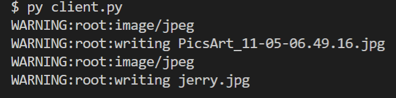

<h3>Melakukan download gambar dengan multithreading</h3>

Program akan melakukan download dengan menggunakan multi threading. Disini saya menggunakan 2 thread, dimana thread akan bekerja secara synchronous (menunggu thread sebelumnya selesai, lalu lanjut ke thread selanjutnya).

1. Menjalankan client.py
```python
  py client.py
```
2. Jalannya client.py pada terminal

3. Gambar yang diunduh (2 gambar)


